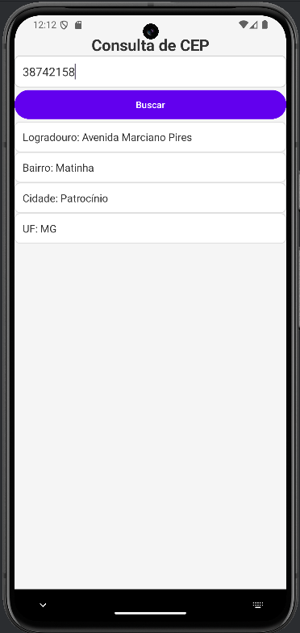

# Projeto Consulta de CEP

Este é um projeto de aplicativo Android para consultar informações de endereço a partir de um CEP (Código de Endereçamento Postal) usando a API pública do [ViaCEP](https://viacep.com.br/). O projeto foi desenvolvido como parte da disciplina **Dispositivos Móveis**.

## Funcionalidades

- O usuário pode digitar um CEP no campo de entrada.
- Ao clicar no botão "Buscar", o aplicativo consulta a API do ViaCEP.
- O aplicativo exibe as informações do endereço, como:
  - Logradouro
  - Bairro
  - Cidade
  - UF (Unidade Federativa)
  
## Pré-requisitos

Para rodar este projeto, você precisará ter:

- **Android Studio**: Uma IDE para desenvolvimento Android.
- **SDK do Android**: Certifique-se de ter o SDK adequado instalado no seu Android Studio.
- **Dependências do projeto**: A biblioteca `OkHttp` para fazer requisições HTTP.

## Como Rodar o Projeto

1. Clone este repositório para o seu computador:

   ```bash
   git clone https://github.com/Vitaedoca/viacep.git


